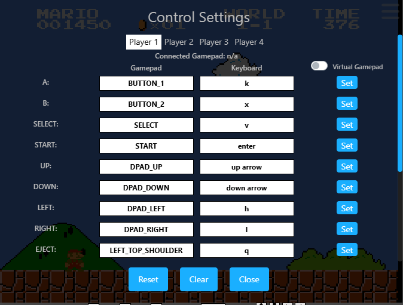

# Getting Started

If you want to play game online using `main_controller.py` please do the following

## Step 1: Visit Online Game
```
https://www.smbgames.be/super-mario-bros.php
```

From the game, you may have to modify `gamepad key` to match with our controller as follow:


In general key mapping a follow
```
online game keypad
- z jump
- left arrow
- right arrow

our main controller mapping
- k jump
- h left
- i right
```

## Launch Our Controller
```
py -3.9 main_controller.py
```